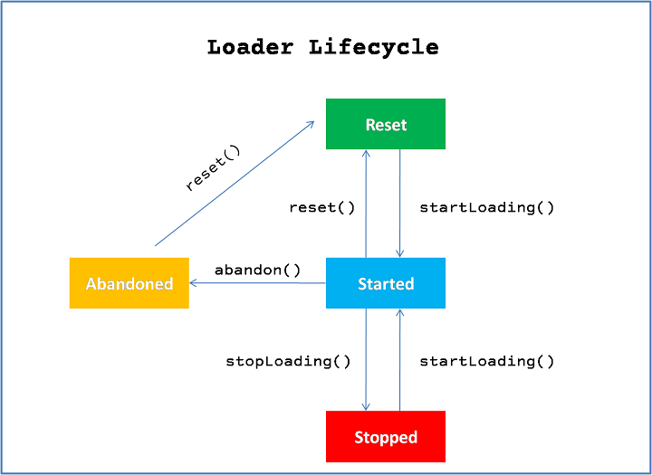
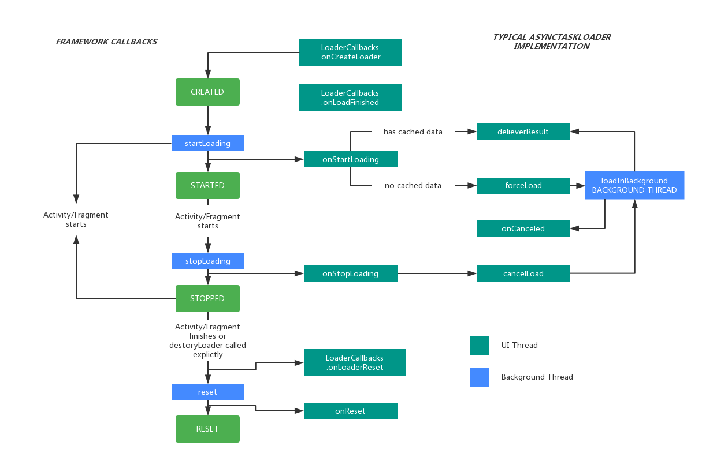

# 4. Loader探索

在前面的章节，我们已经熟悉了最简单的、高阶的、Android特有的异步概念：`android.os.AsyncTask`。`AsyncTask`是一个用来创建后台工作的简洁的概念，它提供了一个简单的接口来公布结果并且发送进度给主线程。在本章节中，我们将焦点转移到`android.content.Loader`，一个用来在一个具有内容更改功能和组件生命周期意识的工作线程上从内容提供者或数据源中异步加载内容的高阶的Android特有的模式。

本章节我们将涉及以下主题：

- `Loaders`介绍
- `Loader` API
- `Loader`生命周期
- 使用`Loader`加载数据
- 使用`AsyncTaskLoader`构建响应式应用
- 使用`CursorLoader`构建响应式应用
- 组合`Loaders`
- `Loaders`的应用

## Loaders介绍

顾名思义，Loader的工作就是为应用的其它部分加载数据，并且使这些应用在位于同一进程中的activities和fragments之间可用。创造Loaders框架是为了解决几个关于在Activities和Fragments中异步加载的问题：

- **后台处理**：那些繁重的工作任务在一个后台线程被执行，完成的结果被安全的引入到主线程。
- **结果缓存**：已加载完成的数据能够被缓存起来，在重复调用的时候被重新传递以提高速度和效率。
- **生命周期意识**：此框架能够让我们控制一个Loader实例何时被销毁，并且允许Loaders存活于Activity生命周期之外，使它们的数据在应用之间、Activity重新启动之间可用。
- **数据变更管理**：Loaders监控它们底层的数据源，在需要的时候在后台重新加载它们的数据。此框架包含了允许我们妥善处理任何被我们的Loaders所持有的昂贵资源的生命周期回调函数。

## Loader API

`Loader` API是在API级别11的时候被引入到Android平台的，但通过support库已经能够向后兼容。本章节的示例使用support库来支持从7到23的目标API级别.

框架定义了一系列接口、抽象类和loader的实现用来为你的应用创造一等的Android数据加载器。

Loaders能够监控内容并传递新的更改，同时在一个Activity转场或由配置更改触发的Activity替换中存活。这个框架提供的API类和接口是：

- `android.content.Loader<DataType>`：定义基础方法的无功能（抽象）的基类
- `android.app.LoaderManager`：管理在activities和fragments中的loaders
- `android.app.LoadManager.LoaderCallbacks`：用于监听Loader的事件的回调
- `android.content.AsyncTaskLoader<DataType>`：在`AsyncTask`上执行加载的Loader子类
- `android.content.CursorLoader`:用于处理Android内部数据库和内容提供者的数据源的Loader实现类

最后两个是非抽象的子类，我们将在本章节的下个部分通过示例深入其中的细节。

### Loader

`Loader`是一个向外暴露一个泛型参数的泛型类，其自身并不实现任何异步行为：

```java
public class Loader<DataType>
```

`<DataType>`泛型定义了你的`Loader`将要传递的结果类型，并且应该被任何实现了一个具体领域的`Loader`子类所定义。

当你创建自己的loader时，有5个`Loader`的方法我们必须实现来创建一个具有完整功能的`Loader`：

```java
protected void onStartLoading()
protected void onStopLoading()
protected void onForceLoad()
protected void onReset()
protected void onCancelLoad()
```

`onStartLoading()`是子类开始加载数据必须实现的方法。方法`onStopLoading()`是用来实现当一个loader由于所关联的activity或fragment停止了而被请求停止时的行为。在这个状态下，`Loader`可能会继续处理，但不应该传递更新到Activity，直到`onStartLoading()`再次被调用。

`onForceLoad()`是用来忽略以前已加载的数据集并加载新的数据时应该实现的方法，就像清理缓存。如果你的loader不再被调用，`onReset()`方法由`LoaderManager`自动为你调用，以此释放loader的所有资源。

`onCancelLoad()`方法在主线程上被调用，用来实现当调用`Loader.cancelLoad()`后，数据加载被取消时的行为。

尽管我们可以直接继承`Loader`,但更常见的做法是根据我们的需求，使用已经提供的2个子类`AsyncTaskLoader`，`CursorLoader`中的一个。

`AsyncTaskLoader`是一个通用的`Loader`，我们可以在我们想要从几乎任何类型源加载几乎任何类型的数据并且与主线程脱离的情况下继承它。

`CursorLoader`继承自`AsyncTaskLoader`，用来专门高效的从本地数据库获取数据，同时正确的管理与数据库相关联的`Cursor`。

### LoaderManager

当我们使用`Loaders`时,由于它是一个小框架的一个组成部分，我们不会单独使用它。`Loaders`是被管理的对象，由`LoaderManager`打理。`LoaderManager`照料着`Loader`生命周期事件与Fragment和Activity生命周期之间的相互协调，并且`Loader`实例能够对贯穿整个应用的客户端代码可用。定义在`android.support.v4.content.LoaderManager`和`android.app.LoaderManager`中的`LoaderManager`抽象类可以通过成员函数`getLoaderManager`被所有的Activities和Fragments访问：

```java
LoaderManager getLoaderManager()
// android.support.v4
LoaderManager getSupportLoaderManager()
```

`LoaderManager`提供了一个API，可以在不受客户端（Activity或Fragment）生命周期的约束下，被客户端用来建立、初始化、重启和销毁`loaders`。当你获取一个管理客户端的`LoaderManager`时，`LoaderManager`中与之关联性最大的可访问的方法是：

```java
Loader<D> initLoader(int id, Bundle args, LoaderManager.LoaderCallbacks<D> callback)
Loader<D> restartLoader(int id, Bundle args, LoaderManager.LoaderCallbacks<D> callback)
Loader<D> getLoader(int id)
void destroyLoader(int id)
```

由`LoaderManager`定义的所有方法中的id参数用来识别在客户端上下文中的`Loader`，此外，还用在`LoaderManager`所有在一个指定的`Loader`中触发任何动作的APIs中。

`initLoader`方法是用来初始化一个已确定的`Loader`，但如果在`LoaderManager`中已经存在一个具有相同ID的`Loader`则不会再创建一个新的`Loader`。

`restartLoader`方法用来启动或重启一个`Loader`。然而，如果一个与传入的ID相关联的`Loader`已经存在，那么那个旧的`Loader`将会在完成自身工作时被销毁。

`destroyLoader`方法用来显示的停止带有由参数id所指定的ID的`Loader`，并将其从`LoaderManager`中移除。

### LoaderManager.LoaderCallbacks

为了与`LoaderManager`交互，客户端需要实现`LoaderCallbacks<D>`接口和接收事件分别来为给定的ID创建一个新的`Loader`、接收`Loader`的结果，或者是重置一个`Loader`：

```java
Loader<D> onCreateLoader(int id, Bundle args)
void onLoadFinished(Loader<D> loader, D data)
void onLoaderReset(Loader<D> loader)		
```

如之前的详细说明，泛型`D`指定了`Loader`的返回类型和当`Loader`达到某一特定生命周期的状态时被`LoaderManager`调用的回调函数的类型：

- `onCreateLoader`：这是一个创建方法，它用一个给定的`Bundle`对象为一个指定的ID启动一个`Loader`。这个`Bundle`对象用来为`Loader`的创建传递参数。这个方法会在当客户端调用`initLoader`,并且`LoaderManager`中没有带有与指定的ID相关联的`Loader`存在时被调用。
- `onLoadFinished`：此方法在`Loader`取得结果时被调用。该回调被调用时拥有该`loader`的结果和获取该结果的`Loader`的引用。当`Loader`在已请求的数据上发现了内容变化，它将会将新的结果汇报回来，因此，这个方法可能会被调用多次。此方法是用已加载的数据的来更新UI的典型代表。
- `onLoaderReset`：这个是当一个给定ID的`Loader`将要销毁的时候被调用的方法。这是释放一些资源和依附在一个指定ID上的引用的最佳地点。


### Loader生命周期

任何一个由`LoaderManager`所管理的`Loader`对象都可以在由6中不同的标志所定义的`Loader`状态：

- **Reset**：这个标志在当你创建一个`Loader`实例的时候设置你的`Loader`。这个标志将会在`reset()`方法调用的地方结束。当`reset`向这个状态移动时，`onReset()`将会被调用。开发者必须使用此方法来释放在`Loader`上申请的资源，并且重置所有缓存结果。
- **Started**：当你的`Loader`的`startLoading()`方法被调用的时候将会设置这个标志。当你的`Loader`进入这个状态之后，`onStartLoading()`方法会被调用来设置你的加载资源。如果`Loader`已经传递了结果，你可以调用`forceLoad()`来重新启动一个新的加载。你的`loader`应该只在这个标志开启的时候传递结果。
- **Stopped**：当`Loader`停止并且不能够传递新的结果或者内容变更的传递。在这个状态下，loader可以在loader被重启的时候储存结果用于传递。为了实现loader何时将这个状态开启，开发者必须实现`onStopLoading()`方法并且释放所有用来加载结果所申请的资源。
- **Abandoned**：这是一个用于确定`Loader`是否被废弃的可选的中间标志。和其它方法类似，子类必须实现`onAbandon()`方法以实现客户端何时不再对从loader中更新新数据感兴趣的运转状态。在这个**Reset**之前的状态下，`Loader`不要报道任何新的更新，但它可以保留结果用来在`loader`重启的时候传递。
- **ContentChanged**：这是用来提醒`Loader`的内容已改变的标志。当在加载中发现一些内容变更，`onContentChanged`回调会被调用。
- **ProcessingChange**：这个标志提醒`Loader`正在处理内容上的一个变化。接下来的函数`takeContentChange()`，`commitContentChanged()`和`rollbackContentChanged()`是用来管理数据内容变更和它的处理状态。

> 图4.1 Loader生命周期：



### 使用Loader加载数据

到目前为止，我们仅仅描述了理论实体和在API中可用的类，因此现在是时候用一些简单的例子来说明这些概念。

在我们的例子中，我们将向你展示如何使用`LoaderManager`，`LoaderCallback`和`Loader`来展现一个列出某个聊天应用当前所有在线的用户的名字的`Activity`。

首先，我们打算创建一个将要作为`LoaderManager`的客户端的`Activity`；它将有3个按钮，**INIT**,**RESTART**和**DESTORY**；分别用于初始化，重启和销毁`Loader`。由于这个`Activity`实现了`LoaderCallback`回调作为它的成员函数，它将直接收到该回调：

```java
public class WhoIsOnlineActivity extends FragmentActivity
	implements LoaderCallbacks<List<String>> {
	public static final int WHO_IS_ONLINE_LOADER_ID = 1;
	@Override
	protected void onCreate(Bundle savedInstanceState) {
      ...
      final LoaderManager lm = getSupportLoaderManager();
      final Bundle bundle = new Bundle();
      bundle.putString("chatRoom", "Developers");
      initButton.setOnClickListener(new View.OnClickListener() {
        @Override
        public void onClick(View v) {
            lm.initLoader(WHO_IS_ONLINE_LOADER_ID, bundle,
            WhoIsOnlineActivity.this);
        }
      });
      restartButton.setOnClickListener(new View.OnClickListener() {
        @Override
        public void onClick(View v) {
          lm.restartLoader(WHO_IS_ONLINE_LOADER_ID, bundle,
          WhoIsOnlineActivity.this);
        }
      });
      destroyButton.setOnClickListener(new View.OnClickListener() {
        @Override
        public void onClick(View v) {
            lm.destroyLoader(WHO_IS_ONLINE_LOADER_ID);
        }
      });
  }
}
```

点击**INIT**按钮将会以指定的ID和一个我们用于传递参数给`Loader`的一个Bundle对象来初始化`Loader`。并且如前文所述，如果`Loader`已经存在，**RESTART**按钮将会销毁之前的并创建一个新的。如果带有给定ID的`Loader`已经在`LoaderManager`中存在，那么**DESTORY**按钮将会销毁它。这儿的这些按钮仅仅是被用来帮助我们解释`LoaderManager`和`Loader`之间的交互和流程。

在这个具体的用例中，我们将为聊天室开发者加载一个在线用户列表。

现在让我们来看看`LoaderCallback`函数，并且在我们的`Activity`实现它的接口。

从`onCreateLoader`开始，这个`LoaderCallback`回调仅当`loader`之前不存在或者`loader`通过调用`LoaderManager.restartLoader()`方法被重启时被调用。

当我们通过`LoaderManager.initLoader`方法初始化`WhosOnlineLoader`时，它要么返回一个已存在的带有给定ID（LOADER_ID）的`Loader`，要么如果到目前还没有带有给定ID的`Loader`，它将调用`LoaderCallbacks`的第一个方法-`onCreateLoader`。

这意味着这个方法不会在配置改变时被调用，因为一个之前的带有这个ID的`Loader`已经可用并且已初始化。

```java
@Override
public Loader<List<String>> onCreateLoader(int id, Bundle args) {
  Loader res = null;
  switch (id) {
    case WHO_IS_ONLINE_LOADER_ID:
    res = new WhosOnlineLoader(this,
    args.getString("chatRoom"));
    break;
  }
  return res;
}
```

这个方法创建一个`Loader`实例，这个实例调用`WhosOnlineLoader`的构造方法并且传递我们将要加载的聊天组名。

接下来被实现的`LoaderCallback`回调函数是`onLoadFinished`。这个回调在当`Loader`获取到新结果、数据改变或者一个已经在`LoaderManager`中存在的`Loader`配置改变时被调用。

```java
@Override
public void onLoadFinished(Loader<List<String>> loader,
  List<String> users) {
  switch (loader.getId()) {
    case WHO_IS_ONLINE_LOADER_ID:
      ListView listView = (ListView) findViewById(R.id.list);
      ArrayAdapter<String> adapter = new ArrayAdapter<String>(this,
      android.R.layout.simple_list_item_1,
      android.R.id.text1,
      users);
      listView.setAdapter(adapter);
      break;
    }
}
```

在我们的例子中，当`onLoadFinished`被调用时，我们用从`Loader`中接收到的用户列表来更新`ListView`的适配器。

我们的最后一个`LoaderCallback`函数回调是`onLoaderReset`。它在`Loader`被销毁时被调用。在我们的例子中它就是简单地清理在适配器中的列表视图数据。

```java
@Override
public void onLoaderReset(Loader<List<String>> loader) {
  ...
  ListView listView = (ListView)findViewById(R.id.list);
  listView.setAdapter(null);
}
```

`Loader reset`在`LoaderManager.destoryLoader(id)`被调用，或者`Activity`被销毁时被调用。如前文所述，`Loader reset`只是让`Loader`别再发布后续更新，并不是销毁。因此，它会跨越多个`Activity`。

最后一点小事就是我们的自定义`Loader`，用来获取在线用户列表的`WhosOnlineLoader`。由于一个`Loader`的子类并不管理一个后台线程来加载结果，我们的`WhosOnlineLoader`将不会异步加载结果。因此，这个`Loader`应该仅仅被用来作为示例和说明`LoaderManager`和自定义`Loader`之间的交互特性。

出于调试的目的，方法`onStartLoading`、`onStopLoading`、`onReset`和`onForceLoad`每次进入一个函数时都有一个打印的日志信息。传递加载结果给已注册的监听器的`Loader`函数`deliverResult()`也会在用户在线时打印一个信息到Android日志中。

```java
public class WhosOnlineLoader extends Loader<List<String>> {
  private final String mChatRoom;
  private List<String> mResult = null;
  
  public WhosOnlineLoader(Context context, String chatRoom) {
    super(context);
    this.mChatRoom = chatRoom;
  }
  
  @Override
  protected void onStartLoading() {
    Log.i("WhoIsOnlineLoader", "onStarting WhoIsOnlineLoader["
    + Integer.toHexString(hashCode()) + "]");
    ...
    forceLoad();
  }
  
  // Elided for brevity
  @Override
  public void deliverResult(List<String> data) {
    Log.i("WhoIsOnlineLoader", "DeliverResult WhoIsOnlineLoader["
    + Integer.toHexString(hashCode()) + "]");
    ...
    super.deliverResult(data);
  }
  
  @Override
  protected void onReset() {
    Log.i("WhoIsOnlineLoader", "onReset WhoIsOnlineLoader["
    + Integer.toHexString(hashCode()) + "]");
    onStopLoading();
    ...
  }
}
```

`WhosOnlineLoader`的代码一部分被故意忽略了，可是`WhosOnlineLoader`源码可以从`Packt Publishing`网站下载。

> 一切就绪，如果我们启动这个`Activity`，用户在线列表将为空，可是点击**INIT**按钮将会导致调用一个`LoaderManager.init`。

由于在每个`Loader`生命周期的开始我们都有一些踪迹信息，我们可以跟踪这个`loader`回调的调用：

```
I ... LoaderManager.init [1]
I ... LoaderCallbacks.onCreateLoader[1]
I ... Loader.new[ee07113]
I ... Loader.onStarting[ee07113]
I ... Loader.onForceload[ee07113]
I ... Loader.deliverResult[ee07113]
I ... LoaderCallbacks.onLoadFinished[1]
```

如日志输出显示，一个`hashcode`为`ee07113`的新的`Loader`对象实例在我们调用`LoaderManager.init`函数时被创建，与此同时，`onCreateLoader`也被调用。此后，这个`loader`被启动并且结果被加载到传递用户列表的`onLoaderFinished`回调。

既然带有此ID的`Loader`已经在`LoaderManager`中存在，让我们看看当我们点击**RESTART**按钮时将会发生什么：

```
I ... LoaderManager.restart [1]
I ... LoaderCallbacks.onCreateLoader[1]
I ... Loader.new[fb61f50]
I ... Loader.onStarting[fb61f50]
I ... Loader.onForceload[fb61f50]
I ... Loader.deliverResult[fb61f50]
I ... LoaderCallbacks.onLoadFinished[1]
I ... Loader.onReset[ee07113]
I ... Loader.onStopping[ee07113]
```

由于`Loader ee07113`在之前被创建了，它将被停止和重启并且一个新的`Loader`实例将会像它一样在`init`中被创建和启动。

我们现在将要点击**DESTORY**按钮并且来看看结果：

```
I ... LoaderManager.destroy [1]
I ... LoaderCallbacks.onLoaderReset[1]
I ... Loader.onAbandon[fb61f50]
I ... Loader.onReset[fb61f50]
I ... Loader.onStopping[fb61f50]
```

正如所料，`LoaderManager.destory`被调用，并且在其被调用之后，`Loader`的成员方法`onAbandon`、`onReset`和`onStopping`被调用来停止传递结果、释放`Loader`的资源和停止加载数据。当`Loader`被停止时，我们必须取消加载，但它任然可以监视数据源变化。

另一个要解释的重要情景是配置变更。在这个情景下，`LoaderManager`将会继续接收结果并将其保留在本地缓存中。一旦新的`Activity`变为可见状态，缓存的结果将通过`LoaderManager.onLoadFinished`方法被传递。

在一个没有配置变更参与的典型`Activity`过渡中，`LoaderManager`自动重置`Loader`，导致调用`Loader`的`stop`和`reset`函数。

鉴于我们现在理解了如何使用`LoaderManager`管理在`activities`中的`Loader`，现在我们可以将注意力集中到如何使用其子类`AsyncTaskLoader`和`CursorLoader`来创建异步的`Loaders`。

### 使用`AsyncTaskLoader`构建响应式应用

`AsyncTaskLoader`是使用`AsyncTask`来执行后台工作的一个`Loader`实现，但这个过程在我们实现自己的子类时在很大程度上是对我们隐藏的。

我们没有必要操心`AsyncTask`，它们完全被`AsyncTaskLoader`所隐藏。但通过我们之前关于`AsyncTask`的学习，注意使用`AsyncTask.executeOnExecutor(AsyncTask.THREAD_POOL_EXECUTOR)`在默认情况下执行任务来确保多个`Loader`在使用时的高并发是有趣的。

> 在兼容包（android.support.v4.content）中的`AsyncTaskLoader`不依赖于平台中公共的`AsyncTask`。作为替代，兼容包使用一个内部的`ModernAsyncTask`实现避免Android碎片化。`ModernAsyncTask`使用名称`ModernAsyncTask #<N>`来创建线程。

在接下来的部分我们将使用`AsyncTaskLoader`来在后台加载一个货币转比特币的汇率，并且在我们使用`LoaderManager`的`BitcoinExchangeRateActivity`中显示一个更新的汇率。

该汇率将会使用`Loader`的`onContentChanged()`方法持续不断的刷新，这个方法在这个情况下被用来强制在后台更新新的汇率。

`Loader`是一个泛型类，所以我们在实现它的时候需要指定将要加载的对象的类型，在我们的例子中是`Double`。

```java
public class BitcoinExchangeRateLoader extends
  AsyncTaskLoader<Double> {
// ...
}
```

抽象类`Loader`需要将一个`Context`传递给它的的构造方法，所以我们必须传递一个`Context`到继承链。我们还需要知道获取哪个货币的汇率和刷新的时间间隔，因此我们还需要传递一个字符串来标识货币和一个整数来标识间隔（毫秒）。

```java
private Double mExchangeRate = null;
private final long mRefreshinterval;
private final String mCurrency;
BitcoinExchangeRateLoader(Context ctx,
  							String currency,
  							int refreshinterval) {
  super(ctx);
  this.mRefreshinterval = refreshinterval;
  this.mCurrency = currency;
}
```

我们没必要持有我们自己的`Context`对象的引用。`Loader`暴露了一个`getContext()`方法，我们可以在我们的类中任何一个需要`Context`的地方调用它。

> 我们可以安全的传递一个引用给一个`Activity`实例来作为`Context`参数，但我们不应指望`getContext()`返回一个相同的对象！`Loaders`潜在的存活时间比一个单独的`Activity`长得多，因此该`Loader`子类仅仅持有一个应用`Context`的引用来防止内存溢出，这个`context`绑定在一个应用上。

有好几个方法需要我们重载，我们将一次解决一个。其中最重要的是`loadInBackground`-我们`AsyncTaskLoader`的主力，并且是唯一不运行在主线程的方法：

```java
@Override
public Double loadInBackground() {
	//...
}
```

`AsyncTaskLoader`是一个基于`AsyncTask`的`Loader`子类。在底层，它在一个`AsyncTask`的后台线程中调用`loadInBackground`函数。

我们将从互联网获取实时的比特币汇率，更精确的说是从[blockchain.info](blockchain.info)网站上获取来延迟建立连接，在设备和远程端点间传输数据和由网络访问所暴露的延时。由于延迟的范围可能从毫秒到秒，这个任务是一个脱离主线程执行的好的候选。

接下来的图解显示了`Loader`的生命周期，展示了`LoaderManager`的回调调用和一个典型的`AsyncTaskLoader`实现：



鉴于从网络获取汇率势必由于从网络读取的阻塞IO造成一些延迟，并且远程站点也可能没有足够的资源来将响应发送回来。我们作为不想产生烦人的Android ANRs的清醒开发者，必须将这些类型的操作转移到在系统后台线程中被执行的`AsyncTaskLoader.loadInBackground`方法中。

在我们接收到携带汇率的响应之后，我们需要对出现在HTTP响应中的JSON响应进行解码，因此这也是一个我们明确需要脱离主线程来执行的操作！

```java
public Double loadInBackground() {
  Double result = null;
  StringBuilder builder = new StringBuilder();
  URL url = new URL("https://blockchain.info/ticker");
  // Create a Connection to the remote Website
  HttpURLConnection conn = (HttpURLConnection)
  url.openConnection();
  ...
  conn.setRequestMethod("GET");
  conn.setDoInput(true);
  conn.connect();
  // ! Read the response with the exchange rate to a String
  ...
  // Decode the Response Received by Blockchain Website
  JSONObject obj = new JSONObject(builder.toString());
  result = obj.getJSONObject(mCurrency)
  .getDouble("last");
  return result;
}
```

在前面的代码中，我们执行了之前建议的阻塞操作，结果我们返回了在`Loader`的构造方法中指定的汇率。

我们想要缓存我们正传递的`Double`对象的引用，从而未来的任何调用正好可以立即返回同样的`Double`。我们将通过重写在主线程被调用的`deliverResult`方法来达到这个目的：

```java
@Override
public void deliverResult(Double result) {
  this.mExchangeRate = result;
  super.deliverResult(result);
}
```

为了使我们的`Loader`真正地工作，我们仍然需要重写少数由`Loader`基类定义的生命周期方法。首要的是`onStartLoading`：

```java
@Override
protected void onStartLoading() {
  if (mExchangeRate != null) {
    // If we currently have a result available, deliver it
    // immediately.
    deliverResult(mExchangeRate);
  }
  if (takeContentChanged() || mExchangeRate == null) {
    // If the exchange rate has changed since the last time
    // it was loaded or is not currently available, start a load.
    forceLoad();
  }
}
```

这里，我们检查我们的缓存（mExchangeRate）来看看是否我们已经有了一个之前加载的结果使我们能够通过`deliverResult`立即传递。如果内容数据已经在最近改变了，`contentChanged`标志是`true`，且并没有缓存的结果，那么我们强制产生一个后台加载 - 我们必须这么做，否则我们的`Loader`将不会加载任何东西。如前文所述，这个回调运行在主线程并且这个加载会立即通过`loadInBackground()`在后台线程中开始一个新的加载。

我们现在有了一个迷你可行的`Loader`实现，但如果要让我们的`Loader`和框架很好一起工作，仍然有一些整理工作需要做。

首先，我们需要确保当我们的`Loader`被废弃的时候，汇率被我们清理干净。`Loader`为了这个目的提供了一个专门的回调 - `onReset`。

```java
@Override
protected void onReset() {
  // Ensure the loader is stopped
  onStopLoading();
  mExchangeRate = null;
}
```

该框架将确保`onReset`在`Loader`被废弃的时候被调用。这将发生在应用退出或者该`Loader`实例通过`LoaderManager`被显式的废弃时。

如果我们希望自己的应用做到尽可能的响应，还有两个生命周期的方法的正确实现也很重要：`onStopLoading`和`onCanceled`（注意这儿的`onCanceled`的拼写与大多数地方的`onCancelled`的对比）。


